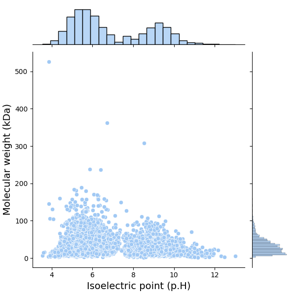
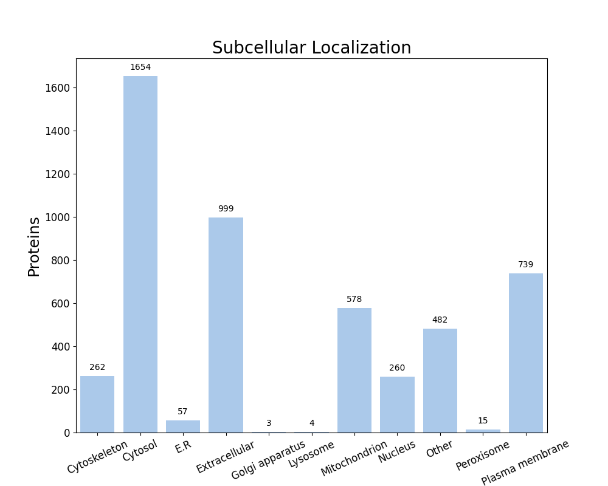

FastProtein Software 1.0
========================
##### Protein Information Software

---
### Summary
| Information                          | Value              |
| ------------------------------------ | ------------------ |
| Processed proteins                   | 5053               |
| Molecular mass (kda) mean            | 34.10 &#177; 25.92 |
| Isoelectric point mean               | 6.93 &#177; 1.90   |
| Hydrophicity mean                    | -0.11 &#177; 0.44  |
| Aromaticity mean                     | 0.08 &#177; 0.03   |
| Proteins with TM                     | 1191               |
| Proteins with SP                     | 891                |
| Proteins with GPI                    | 44                 |
| Membrane proteins                    | 1218               |
| Proteins with E.R Retention domains  | 625                |
| Proteins with NGlycosylation domains | 3109               |
### Molecular mass (kDa) vs Isoelectric point (pH)

---
### Subcellular localization (by WolfPSort) - Organism: animal

| Subcellular localization | Proteins |
| ------------------------ | -------- |
| Cytosol                  | 1654     |
| Extracellular            | 999      |
| Plasma membrane          | 739      |
| Mitochondrion            | 578      |
| Other                    | 482      |
| Cytoskeleton             | 262      |
| Nucleus                  | 260      |
| E.R                      | 57       |
| Peroxisome               | 15       |
| Lysosome                 | 4        |
| Golgi apparatus          | 3        |
---
### E.R Retention domain summary
| Domain | Quantity |
| ------ | -------- |
| QQEL   | 28       |
| KEEL   | 32       |
| ADEL   | 63       |
| AEEL   | 91       |
| AQEL   | 49       |
| ANEL   | 29       |
| REEL   | 60       |
| SDEL   | 33       |
| QEEL   | 29       |
| RDEL   | 54       |
Only top 10

---
### NGlyc domain summary
| Domain | Quantity |
| ------ | -------- |
| NAT    | 317      |
| NAS    | 363      |
| NLS    | 436      |
| NLT    | 398      |
| NIT    | 281      |
| NIS    | 331      |
| NVS    | 290      |
| NGT    | 276      |
| NGS    | 284      |
| NVT    | 328      |
Only top 10

---
| Id     | Length |  kDa   | Isoelectric_Point | Hydropathy | Aromaticity |  Localization   | TMHMM_2 | Phobius_TM | PredGPI | Membrane_evidences | Membrane_evidences_detail  | SignalP5 | Phobius_SP | ER_Retention_Total | NGlyc_Total | ER_Retention_Domains |                                                                                      NGlyc_Domains                                                                                      |                         Header                         | Local_alignment_description | Gene_Ontology | Interpro_Annotation | PFAM_Annotation | Panther_Annotation |
| ------ |:------:|:------:|:-----------------:|:----------:|:-----------:|:---------------:|:-------:|:----------:|:-------:|:------------------:|:--------------------------:|:--------:|:----------:|:------------------:|:-----------:|:--------------------:|:---------------------------------------------------------------------------------------------------------------------------------------------------------------------------------------:|:------------------------------------------------------:| --------------------------- | ------------- | ------------------- | --------------- | ------------------ |
| O82882 |  898   | 99.55  |       6.39        |   -0.48    |    0.10     | Golgi apparatus |    1    |     0      |    -    |         1          |             TM             |    -     |     Y      |         0          |     11      |                      |                       NNS[37-40];NTS[44-47];NGT[146-149];NLS[280-283];NST[391-394];NNS[471-474];NSS[535-538];NWT[611-614];NLS[722-725];NNT[749-752];NLS[855-858]                        |                  Metalloprotease StcE                  | -                           |               |                     |                 |                    |
| P0A6B9 |  404   | 45.09  |       5.94        |   -0.27    |    0.07     |     Cytosol     |    0    |     0      |    -    |         0          |                            |    -     |     -      |         0          |      1      |                      |                                                                                      NVS[301-304]                                                                                       |               Cysteine desulfurase IscS                | -                           |               |                     |                 |                    |
| P0A925 |  254   | 29.02  |       10.13       |    0.26    |    0.12     | Plasma membrane |    6    |     6      |    -    |         3          | PHOBIUS_TM&#124;SL&#124;TM |    -     |     -      |         0          |      0      |                      |                                                                                                                                                                                         |            Phosphatidylglycerophosphatase B            | -                           |               |                     |                 |                    |
| P0A9Q8 |  891   | 96.13  |       6.32        |   -0.07    |    0.07     |     Cytosol     |    0    |     0      |    -    |         0          |                            |    -     |     -      |         0          |      0      |                      |                                                                                                                                                                                         |    Bifunctional aldehyde-alcohol dehydrogenase AdhE    | -                           |               |                     |                 |                    |
| P0AC25 |  285   | 30.99  |       6.43        |    0.77    |    0.12     | Plasma membrane |    6    |     6      |    -    |         3          | PHOBIUS_TM&#124;SL&#124;TM |    -     |     -      |         0          |      1      |                      |                                                                                      NFS[240-243]                                                                                       |                  Formate channel FocA                  | -                           |               |                     |                 |                    |
| P0AGG3 |  286   | 31.97  |       6.17        |   -0.25    |    0.09     |     Cytosol     |    0    |     0      |    -    |         0          |                            |    -     |     -      |         0          |      1      |                      |                                                                                      NGS[184-187]                                                                                       |                Acyl-CoA thioesterase 2                 | -                           |               |                     |                 |                    |
| P43261 |  934   | 101.84 |       8.68        |   -0.38    |    0.10     |  Mitochondrion  |    1    |     0      |    -    |         1          |             TM             |    -     |     Y      |         0          |      8      |                      |                                          NLS[82-85];NMT[155-158];NYT[377-380];NGT[462-465];NSS[536-539];NAS[645-648];NQS[692-695];NTS[799-802]                                          |                        Intimin                         | -                           |               |                     |                 |                    |
| P60063 |  445   | 46.84  |       9.12        |    0.89    |    0.11     | Plasma membrane |   12    |     12     |    -    |         3          | PHOBIUS_TM&#124;SL&#124;TM |    -     |     -      |         0          |      3      |                      |                                                                         NVS[182-185];NVT[197-200];NAT[344-347]                                                                          |              Arginine/agmatine antiporter              | -                           |               |                     |                 |                    |
| P69743 |  372   | 39.65  |       6.27        |   -0.19    |    0.06     |   Peroxisome    |    1    |     1      |    -    |         2          |     PHOBIUS_TM&#124;TM     |    -     |     Y      |         0          |      3      |                      |                                                                         NCS[270-273];NQT[313-316];NVS[330-333]                                                                          |               Hydrogenase-2 small chain                | -                           |               |                     |                 |                    |
| Q7BSW5 |  1300  | 141.76 |       6.36        |   -0.46    |    0.10     |  Extracellular  |    1    |     1      |    -    |         2          |     PHOBIUS_TM&#124;TM     |    -     |     -      |         0          |     14      |                      | NST[141-144];NTS[150-153];NGS[230-233];NQT[301-304];NGS[393-396];NQS[485-488];NTS[502-505];NNT[513-516];NIT[663-666];NIT[680-683];NLS[760-763];NNT[859-862];NLS[912-915];NYT[1058-1061] |                  Serine protease EspP                  | -                           |               |                     |                 |                    |
| Q7DB77 |  558   | 58.02  |       5.01        |   -0.56    |    0.03     | Plasma membrane |    0    |     2      |    -    |         2          |     PHOBIUS_TM&#124;SL     |    -     |     -      |         1          |      6      |    QEEL[351-355]     |                                                        NNS[12-15];NST[36-39];NTT[211-214];NNT[413-416];NTS[475-478];NTS[543-546]                                                        |           Translocated intimin receptor Tir            | -                           |               |                     |                 |                    |
| Q7DBF3 |  364   | 41.55  |       5.86        |   -0.32    |    0.11     |     Cytosol     |    0    |     0      |    -    |         0          |                            |    -     |     -      |         1          |      4      |    REEL[291-295]     |                                                                    NGT[55-58];NET[103-106];NKT[119-122];NKT[181-184]                                                                    |                GDP-perosamine synthase                 | -                           |               |                     |                 |                    |
| Q8X8I2 |  729   | 79.56  |       5.73        |   -0.08    |    0.08     |     Cytosol     |    0    |     0      |    -    |         0          |                            |    -     |     -      |         0          |      2      |                      |                                                                                NKS[273-276];NTS[426-429]                                                                                |       Fatty acid oxidation complex subunit alpha       | -                           |               |                     |                 |                    |
| Q8XAS4 |  423   | 46.62  |       6.61        |   -0.35    |    0.08     |  Mitochondrion  |    0    |     0      |    -    |         0          |                            |    -     |     Y      |         0          |      2      |                      |                                                                                NLT[130-133];NDS[164-167]                                                                                |                    Deferrochelatase                    | -                           |               |                     |                 |                    |
| Q8XB78 |  283   | 31.18  |       5.54        |   -0.23    |    0.11     |     Cytosol     |    0    |     0      |    -    |         0          |                            |    -     |     -      |         0          |      0      |                      |                                                                                                                                                                                         |          Protein/nucleic acid deglycase HchA           | -                           |               |                     |                 |                    |
| Q8XBX8 |  329   | 37.64  |       5.36        |   -0.40    |    0.11     |     Cytosol     |    0    |     0      |    -    |         0          |                            |    -     |     -      |         1          |      6      |    REEL[158-162]     |                                                        NST[19-22];NFT[94-97];NIS[209-212];NRS[259-262];NYS[295-298];NTS[319-322]                                                        | Protein-arginine N-acetylglucosaminyltransferase NleB1 | -                           |               |                     |                 |                    |
| Q8XD24 |  834   | 88.01  |       5.32        |    0.20    |    0.04     | Plasma membrane |    8    |     8      |    -    |         3          | PHOBIUS_TM&#124;SL&#124;TM |    -     |     -      |         0          |      1      |                      |                                                                                      NRS[214-217]                                                                                       |             Copper-exporting P-type ATPase             | -                           |               |                     |                 |                    |
| Q8XE73 |  196   | 20.81  |       5.21        |    0.29    |    0.06     |     Cytosol     |    0    |     0      |    -    |         0          |                            |    -     |     Y      |         0          |      1      |                      |                                                                                      NMT[122-125]                                                                                       |                   protein deglycase                    | -                           |               |                     |                 |                    |
| Q9S5G5 |  355   | 40.29  |       5.86        |   -0.37    |    0.08     |     Cytosol     |    0    |     0      |    -    |         0          |                            |    -     |     -      |         0          |      0      |                      |                                                                                                                                                                                         |    Histidine biosynthesis bifunctional protein HisB    | -                           |               |                     |                 |                    |
| P0A6F2 |  382   | 41.43  |       5.91        |   -0.20    |    0.07     |  Cytoskeleton   |    0    |     0      |    -    |         0          |                            |    -     |     -      |         0          |      1      |                      |                                                                                       NTS[32-35]                                                                                        |        Carbamoyl phosphate synthase small chain        | -                           |               |                     |                 |                    |
| P0A6N3 |  394   | 43.31  |       5.30        |   -0.20    |    0.06     |     Cytosol     |    0    |     0      |    -    |         0          |                            |    -     |     -      |         0          |      1      |                      |                                                                                       NTS[63-66]                                                                                        |                  Elongation factor Tu                  | -                           |               |                     |                 |                    |
| P0A6Q4 |  172   | 18.97  |       6.13        |   -0.01    |    0.10     |     Cytosol     |    0    |     0      |    -    |         0          |                            |    -     |     -      |         0          |      0      |                      |                                                                                                                                                                                         |  3-hydroxydecanoyl-[acyl-carrier-protein] dehydratase  | -                           |               |                     |                 |                    |
| P0A719 |  315   | 34.22  |       5.23        |    0.10    |    0.05     |     Cytosol     |    0    |     0      |    -    |         0          |                            |    -     |     -      |         0          |      3      |                      |                                                                           NAT[9-12];NDT[184-187];NVS[199-202]                                                                           |           Ribose-phosphate pyrophosphokinase           | -                           |               |                     |                 |                    |
| P0A760 |  266   | 29.77  |       6.41        |   -0.18    |    0.08     |  Mitochondrion  |    0    |     0      |    -    |         0          |                            |    -     |     -      |         0          |      0      |                      |                                                                                                                                                                                         |           Glucosamine-6-phosphate deaminase            | -                           |               |                     |                 |                    |
| P0A797 |  320   | 34.84  |       5.47        |    0.00    |    0.07     |     Cytosol     |    0    |     0      |    -    |         0          |                            |    -     |     -      |         0          |      0      |                      |                                                                                                                                                                                         |     ATP-dependent 6-phosphofructokinase isozyme 1      | -                           |               |                     |                 |                    |
| P0A7E7 |  545   | 60.37  |       5.63        |   -0.14    |    0.07     |     Cytosol     |    1    |     0      |    -    |         1          |             TM             |    -     |     -      |         0          |      4      |                      |                                                                     NVT[34-37];NFT[88-91];NLS[271-274];NST[399-402]                                                                     |                      CTP synthase                      | -                           |               |                     |                 |                    |
##### Only top 10 proteins

---

##### Do you have a question or tips? Please contact us! E-mail: renato.simoes@ifsc.edu.br
Generated time: Tue Apr 07 12:54:32 UTC 2026